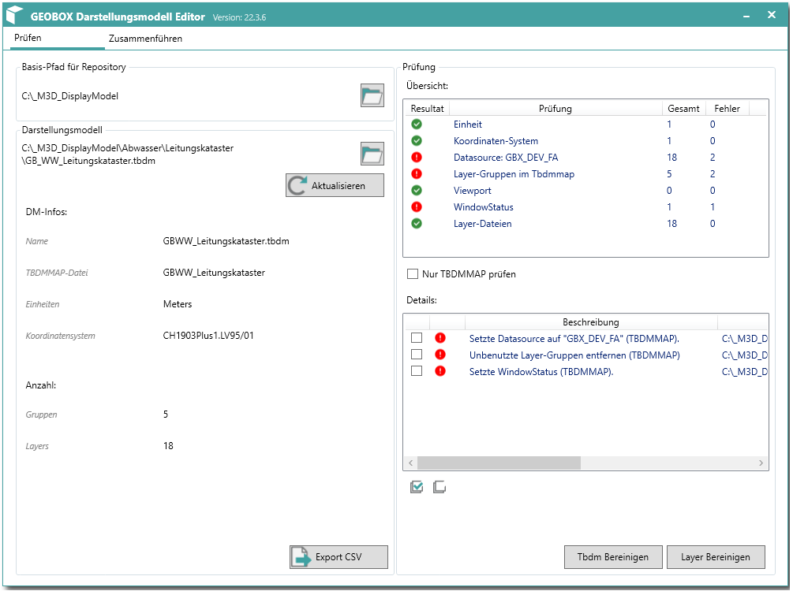

# GEOBOX - Darstellungsmodell Editor
Tool für das prüfen, bereinigen oder zusammenführen von Darstellungsmodellen für das Autodesk AutoCAD Map 3D.

## Beschrieb
Mit diesem Tool können Darstellungsmodelle geprüft und bereinigt werden. Auch ist es möglich zwei Darstellungsmodelle in eines zusammenzuführen.

## Vorgehen
### Darstellungsmodelle prüfen
- Korrekter Pfad zum Repository Pfad auswählen (das Tool folgt der Logik vom AutoCAD Map 3D)
- Darstellungsmodell öffnen
- Prfüungsresultat kontrollieren und bereinigen
### Darstellungsmodelle zusammenführen
- Erstes Darstellungsmodell öffnen
- Zweites Darstellungsmodell öffnen (ergänzt das erste Darstellungsmodell)
- Darstellungsmodell speichern (Speichert die TBM und TBDMAP Datei)

## Voraussetzungen und Installation
### Voraussetzung
- Microsoft .NET Framework 4.8

### Installation
- Es benötigt keine Installation.
- Die Applikation kann aus einem beliebigen Verzeichnis aus gestartet werden.

### Hinweis
- Das Tool setzt keine Installation von Autodesk AutoCAD Map 3D auf der Arbeitsstation voraus.

## Funktionen
### Übersicht 1-Klick-Wartung

### Übersicht Darstellungsmodelle zusammenführen

### Funktionen
| Nr. | Icon     | Beschrieb                                        |
|-----|----------|--------------------------------------------------|
| 1   | ![][i1]  | Exportieren als CSV.                             |
| 2   | ![][i2]  | Aktualisieren der Übersicht.                     |
| 3   | ![][i3]  | Durchsuchen des Verzeichnisses.                  |
| 4   | ![][i4]  | Prüfergebnis ist in Ordnung.                     |
| 5   | ![][i5]  | Es sind Fehler gefunden worden.                  |
| 6   | ![][i6]  | Alle Zeilen selektieren.                         |
| 7   | ![][i7]  | Selektion aller Zeilen aufheben.                 |

[i1]:  _images/FileExport_light_024.png "CSV Export"
[i2]:  _images/Refresh_light_024.png "Update"
[i3]:  _images/Open_light_024.png "Open"
[i4]:  _images/gbLogSuccess16.png "Ok"
[i5]:  _images/gbLogError16.png "not Ok"
[i6]:  _images/CheckAll_light_016.png "Check All"
[i7]:  _images/UncheckAll_light_016.png "Uncheck All"
